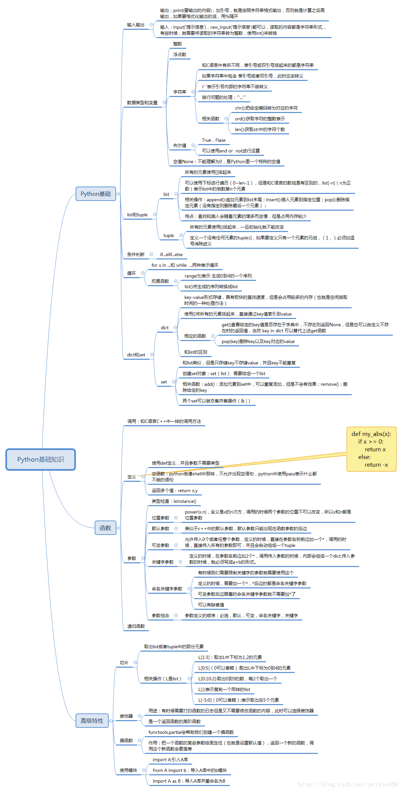

## Week2 -- Python 基础编程

> #### 课前预习
* 请学习在github上创建项目仓库，并从本地提交到README.md到新建github的仓库 [[参考](https://www.cnblogs.com/specter45/p/github.html)]
* Markdown基础格式学习（不作要求） [[参考](https://www.cnblogs.com/xinmengwuheng/p/5794899.html)]
* 请学习Jupyter notebook的使用 [[参考](https://www.cnblogs.com/nxld/p/6566380.html)]
* 在Jupyter notebook中写几行简单的代码，比如赋值、循环、字符串操作等

> #### 课堂任务
#### 如何学习编程
* 编程学习的轮回

* python基础编程学习线路
    + Python（一）基础篇之「基础&数据类型&控制流」
    + Python（二）基础篇之「函数&函数式编程」
    + Python（三）基础篇之「模块&面向对象编程」
    + Python（四）基础篇之「文件对象&错误处理」
    + Python（五）数值计算库之「NumPy」
    + Python（六）数值计算库之「Pandas」
    + Python（七）数据可视化之「Matplotlib」
    + Python（八）常用扩展库
    + Python（九）爬虫常用库

* 课程教学方式 
    + 理论 + 阅读代码 + 编程 （课上练习 + 课后 + 个人作业 + 小组项目作业）
    + 每周上课之前将课前预习部分上传到平台，自行完成课前学习内容
    + 定期答疑与code review

* python基础思维导图

> #### 课堂练习