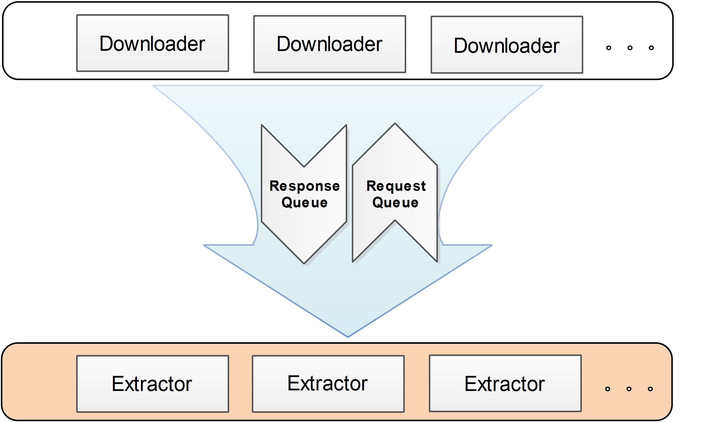
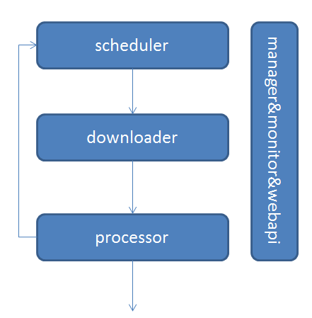
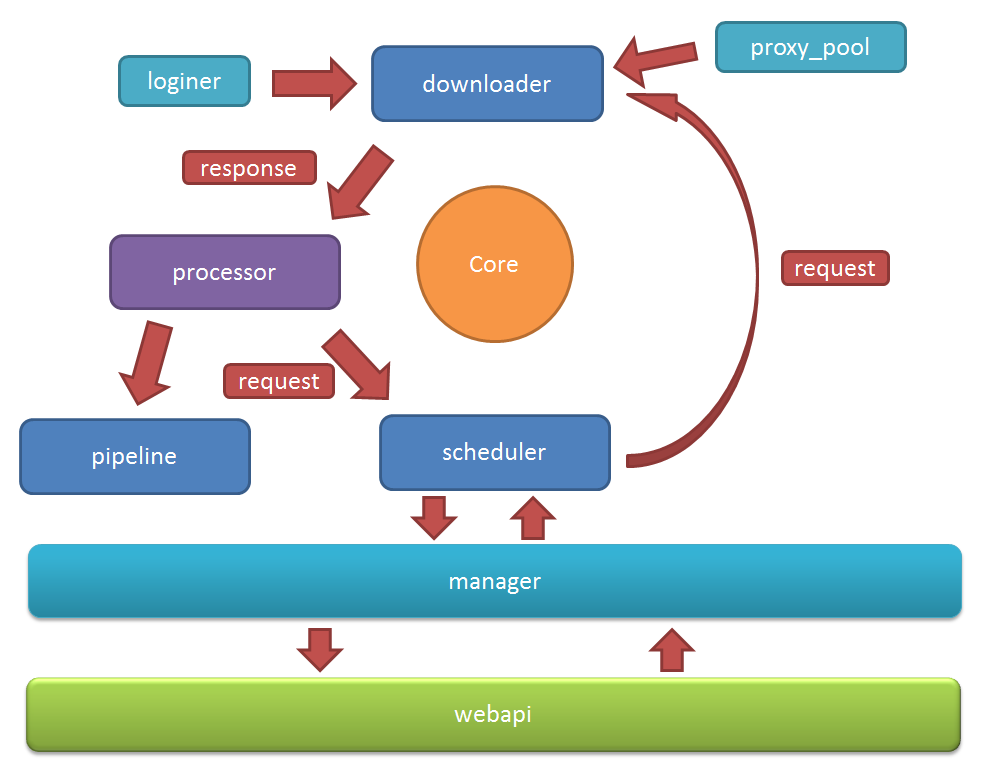
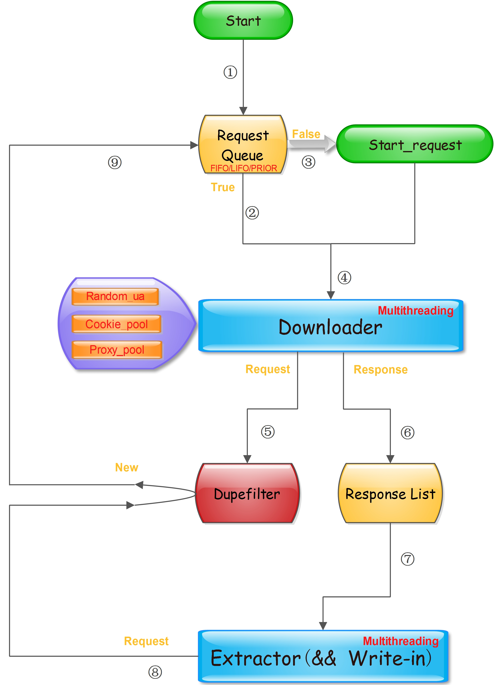
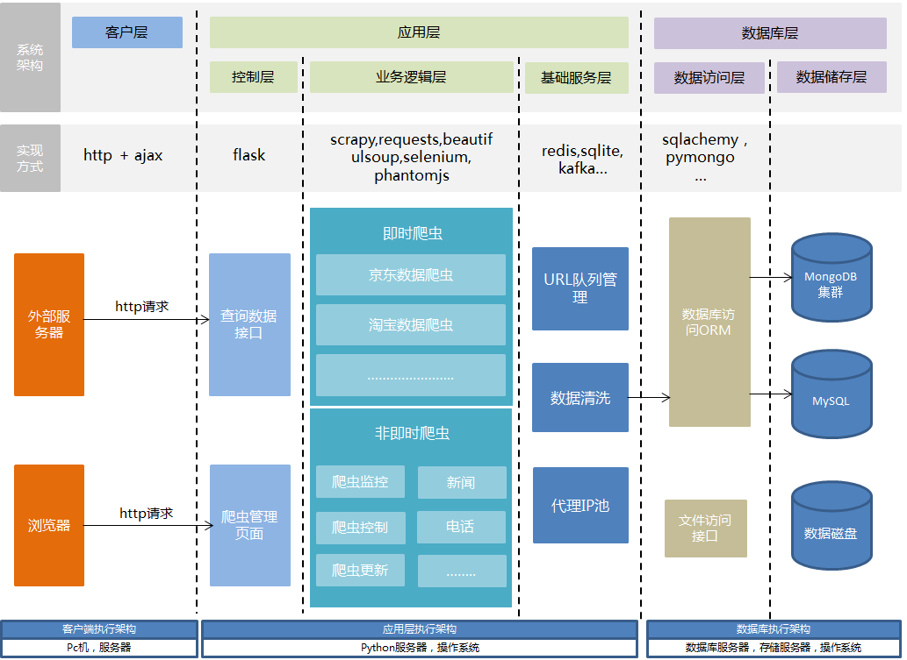

# Week8 -- Python 高级编程（二） 

> ### 课前预习
* 无

> ### 课堂任务
<b><i>Previously On Week7</i></b>
 * <i>浏览器调试、[jQuery教程](https://www.runoob.com/jquery/jquery-tutorial.html)</i>
 * <i>urllib库简介 [&para;](https://www.jianshu.com/p/0e7fc1b6b5cc)</i>

#### 爬虫原理图
>##### 简易爬虫架构

>##### 爬虫架构演进一 -- 定时任务和管理器

>##### 爬虫架构演进二 -- 登录器和代理池

>##### 爬虫架构演进三 -- 多线程、随机UA、Cookie池、重复检测

<b>架构主要分两部分，下载器（Downloader）和提取器（Extractor）。</b>
* <b>下载器专注于数据的下载</b>，可为下载器配置UA池或fake_useragent、cookie池、代理IP池（需要本地维护），不会做任何数据处理任务，下载成功后将数据写入Redis中定义好的Response List，并将用于下载的Request写入Dupefilter；
* <b>提取器就会从Response List中拉取Response进行解析</b>，不同网站使用不同key存储List。这里使用Redis作为Response中转是因为当运行的下载器数量较多时，返回大量的Response不一定能被提取器及时解析入库（数据库存储量达到一定级别后，磁盘IO可能大于网络IO），若放在内存中可能由于程序意外停止而丢失已经下载的Response（未入库）。

* <b>Dupefilter</b>：使用BloomFilter可以有效节省去重集合对内存的消耗，取Redis中的256M字符串可对9000万条Url进行去重，漏失率为1.12e-04，漏失率和去重Url的数量关系可参考基于Redis的Bloomfilter去重，也就是说漏失率是可以控制的。

* <b>Request Queue</b>：此队列可采用Redis的List或Zset数据类型实现，前者实现FIFO和LIFO队列，后者实现PRORI队列
* <b>Downloader和Extractor都可以分布式部署</b>，只需配置好Redis服务的网络地址。两者的多线程部署有助于充分利用单机的带宽资源，CPU利用率提升可能不明显，爬虫始终是偏IO密集型的活动。

* <b>Request和Response</b>：Request对象可作为一个字典来存，字典包含请求的url、cookie、headers、body、params、method以及others属性，Response也作为一个字典，包含下载到的html、cookies、headers、url以及others属性；这会有利于复杂页面的抓取。

>##### 爬虫架构演进四 -- 管理api、实时性、多站点、数据抽取、队列、代理池


在大型爬虫项目中，使用分布式架构是提高爬取效率的唯一途径。设计一个合理的分布式架构对项目、对个人都有很大的好处，接下来说说分布式架构应该具有的特性：

* <b><i>分布式。</b></i>这是最基本也是最核心的特性，分布式将允许我们通过横向扩展主机资源来提高爬取效率。
* <b><i>易扩展、易部署。</b></i>当我们想要增加要爬取的网站时，只需要专注于爬取规则、解析规则、入库规则部分的代码编写就ok，其他的如日志、异常处理则让底层架构实现。
* <b><i>各功能高度模块化。</b></i>模块化有利于架构的松耦合，以至于以后想要添加新的功能无需进行大的改动；同时也使得整个架构更清晰简明。
* <b><i>可监控。</b></i>通过架构部署启动爬虫之后，可以通过某种方式监控Request队列实时大小、已入库的Item条数，以确认爬虫工作状态。
* <b><i>高性能。</b></i>即使在单机上部署此架构也能充分利用主机CPU、带宽等资源，比较耗时的主要是下载页面和入库两个环节，当Request队列不断增长的时候，消费Request的能力也必须跟上，否则队列会消耗过多内存资源，且爬取效率低。入库同理，这两个环节都是IO密集型任务，所以恰好可以利用python的多线程来提高效率。
* <b><i>Request队列、去重集合的持久化</b></i>，实现断点续爬和增量爬取。
* <i>【其他】</i>非实时爬虫定时爬取网站的策略。
>
##### <i>网站更新策略</i>
    一个网站的网页经常会更新，作为爬虫方，在网页更新后，
    我们则需要对这些网页进行重新爬取， 那么什么时候去爬取合适呢？
    如果网站更新过慢，而爬虫爬取的过于频繁，则会带来服务器资源的浪费。
    若网站更新过快，但爬虫提取的时间间隔较长，则我们爬去的内容版本会过老，
    不利于新内容的爬取。显然，网站的更新频率与爬虫访问网站的频率越接近，
    则效果越好，当然，爬虫服务器资源有限的时候， 此时爬虫也需要根据对应的策略，
    让不同网页具有不同的更新优先级，优先极高的网页更新，将获得较快的爬取响应。

#### 爬虫之网络编程（二）
* 网页中加入jquery的代码
```
javascript: var oHead = document.getElementsByTagName('HEAD').item(0); var oScript= document.createElement("script"); oScript.type = "text/javascript"; oScript.src="https://libs.baidu.com/jquery/2.0.0/jquery.min.js"; oHead.appendChild( oScript);alert('jquery%E6%B3%A8%E5%85%A5%E5%AE%8C%E6%88%90');
```
* jquery css选择器示例
>##### 练习
> 在浏览器中打开网址https://www.beijing2022.cn/cn/presscentre/newslist.htm
循环将网页中新闻列表的新闻标题用jquery的方法抽取出来

* requests库 [&para;](https://www.cnblogs.com/saneri/p/9870901.html)
  + 使用代理 [&para;](https://www.jianshu.com/p/c8f896d668d6)
  + 修改请求头
```
import requests
设置代理
proxies = {
  "http": "http://10.10.1.10:3128",
  "https": "http://10.10.1.10:1080",
}
requests.get("http://example.org", proxies=proxies)

# 修改请求头
url = 'https://www.baidu.com/s?wd=python'
headers = {
        'Content-Type': 'text/html;charset=utf-8',
        'User-Agent' : 'Mozilla/5.0 (Windows NT 10.0; Win64; x64)'
    }
r = requests.get(url,headers=headers)
```
* [PyQuery](https://blog.csdn.net/baidu_41871794/article/details/84195995)
* 调用浏览器
【注意】webdriver与chrome版本的对应

#### 正则表达式（一）
正则表达式规则表 [&para;](https://superxiaoqiang.github.io/blcu_py_nlp/python_notes/05-advanced-python/05.04-regular-expression.html#正则表达式规则)

正则表达式常用方法
* re.match & re.search
>在 re 模块中， re.match 和 re.search 是常用的两个方法：
    re.match(pattern, string[, flags])
    re.search(pattern, string[, flags])
    两者都寻找第一个匹配成功的部分，成功则返回一个 match 对象，不成功则返回 None，不同之处在于 re.match 只匹配字符串的开头部分，而 re.search 匹配的则是整个字符串中的子串。
* re.findall
>re.findall(pattern, string) 返回所有匹配的对象列表
* re.split
>re.split(pattern, string[, maxsplit]) 按照 pattern 指定的内容对字符串进行分割。
* re.sub
>re.sub(pattern, repl, string[, count]) 将 pattern 匹配的内容进行替换。
* re.compile
>re.compile(pattern) 生成一个 pattern 对象，这个对象有匹配，替换，分割字符串的方法。
#### 爬虫学习扩展知识
##### 一些常用的正则匹配模式
```
一、校验数字的表达式
数字：^[0-9]*$
n位的数字：^\d{n}$
至少n位的数字：^\d{n,}$
m-n位的数字：^\d{m,n}$
零和非零开头的数字：^(0|[1-9][0-9]*)$
非零开头的最多带两位小数的数字：^([1-9][0-9]*)+(\.[0-9]{1,2})?$
带1-2位小数的正数或负数：^(\-)?\d+(\.\d{1,2})$
正数、负数、和小数：^(\-|\+)?\d+(\.\d+)?$
有两位小数的正实数：^[0-9]+(\.[0-9]{2})?$
有1~3位小数的正实数：^[0-9]+(\.[0-9]{1,3})?$
非零的正整数：^[1-9]\d*$ 或 ^([1-9][0-9]*){1,3}$ 或 ^\+?[1-9][0-9]*$
非零的负整数：^\-[1-9][]0-9"*$ 或 ^-[1-9]\d*$
非负整数：^\d+$ 或 ^[1-9]\d*|0$
非正整数：^-[1-9]\d*|0$ 或 ^((-\d+)|(0+))$
非负浮点数：^\d+(\.\d+)?$ 或 ^[1-9]\d*\.\d*|0\.\d*[1-9]\d*|0?\.0+|0$
非正浮点数：^((-\d+(\.\d+)?)|(0+(\.0+)?))$ 或 ^(-([1-9]\d*\.\d*|0\.\d*[1-9]\d*))|0?\.0+|0$
正浮点数：^[1-9]\d*\.\d*|0\.\d*[1-9]\d*$ 或 ^(([0-9]+\.[0-9]*[1-9][0-9]*)|([0-9]*[1-9][0-9]*\.[0-9]+)|([0-9]*[1-9][0-9]*))$
负浮点数：^-([1-9]\d*\.\d*|0\.\d*[1-9]\d*)$ 或 ^(-(([0-9]+\.[0-9]*[1-9][0-9]*)|([0-9]*[1-9][0-9]*\.[0-9]+)|([0-9]*[1-9][0-9]*)))$
浮点数：^(-?\d+)(\.\d+)?$ 或 ^-?([1-9]\d*\.\d*|0\.\d*[1-9]\d*|0?\.0+|0)$

二、校验字符的表达式
汉字：^[\u4e00-\u9fa5]{0,}$
英文和数字：^[A-Za-z0-9]+$ 或 ^[A-Za-z0-9]{4,40}$
长度为3-20的所有字符：^.{3,20}$
由26个英文字母组成的字符串：^[A-Za-z]+$
由26个大写英文字母组成的字符串：^[A-Z]+$
由26个小写英文字母组成的字符串：^[a-z]+$
由数字和26个英文字母组成的字符串：^[A-Za-z0-9]+$
由数字、26个英文字母或者下划线组成的字符串：^\w+$ 或 ^\w{3,20}$
中文、英文、数字包括下划线：^[\u4E00-\u9FA5A-Za-z0-9_]+$
中文、英文、数字但不包括下划线等符号：^[\u4E00-\u9FA5A-Za-z0-9]+$ 或 ^[\u4E00-\u9FA5A-Za-z0-9]{2,20}$
可以输入含有^%&',;=?$\"等字符：[^%&',;=?$\x22]+
禁止输入含有~的字符：[^~\x22]+

三、特殊需求表达式
Email地址：^\w+([-+.]\w+)*@\w+([-.]\w+)*\.\w+([-.]\w+)*$
域名：[a-zA-Z0-9][-a-zA-Z0-9]{0,62}(/.[a-zA-Z0-9][-a-zA-Z0-9]{0,62})+/.?
InternetURL：[a-zA-z]+://[^\s]* 或 ^http://([\w-]+\.)+[\w-]+(/[\w-./?%&=]*)?$
手机号码：^(13[0-9]|14[5|7]|15[0|1|2|3|5|6|7|8|9]|18[0|1|2|3|5|6|7|8|9])\d{8}$
电话号码("XXX-XXXXXXX"、"XXXX-XXXXXXXX"、"XXX-XXXXXXX"、"XXX-XXXXXXXX"、"XXXXXXX"和"XXXXXXXX)：^(\(\d{3,4}-)|\d{3.4}-)?\d{7,8}$
国内电话号码(0511-4405222、021-87888822)：\d{3}-\d{8}|\d{4}-\d{7}
电话号码正则表达式（支持手机号码，3-4位区号，7-8位直播号码，1－4位分机号）: ((\d{11})|^((\d{7,8})|(\d{4}|\d{3})-(\d{7,8})|(\d{4}|\d{3})-(\d{7,8})-(\d{4}|\d{3}|\d{2}|\d{1})|(\d{7,8})-(\d{4}|\d{3}|\d{2}|\d{1}))$)
身份证号(15位、18位数字)，最后一位是校验位，可能为数字或字符X：(^\d{15}$)|(^\d{18}$)|(^\d{17}(\d|X|x)$)
帐号是否合法(字母开头，允许5-16字节，允许字母数字下划线)：^[a-zA-Z][a-zA-Z0-9_]{4,15}$
密码(以字母开头，长度在6~18之间，只能包含字母、数字和下划线)：^[a-zA-Z]\w{5,17}$
强密码(必须包含大小写字母和数字的组合，不能使用特殊字符，长度在 8-10 之间)：^(?=.*\d)(?=.*[a-z])(?=.*[A-Z])[a-zA-Z0-9]{8,10}$
强密码(必须包含大小写字母和数字的组合，可以使用特殊字符，长度在8-10之间)：^(?=.*\d)(?=.*[a-z])(?=.*[A-Z]).{8,10}$
日期格式：^\d{4}-\d{1,2}-\d{1,2}
一年的12个月(01～09和1～12)：^(0?[1-9]|1[0-2])$
一个月的31天(01～09和1～31)：^((0?[1-9])|((1|2)[0-9])|30|31)$
钱的输入格式：
    有四种钱的表示形式我们可以接受:"10000.00" 和 "10,000.00", 和没有 "分" 的 "10000" 和 "10,000"：^[1-9][0-9]*$
    这表示任意一个不以0开头的数字,但是,这也意味着一个字符"0"不通过,所以我们采用下面的形式：^(0|[1-9][0-9]*)$
    一个0或者一个不以0开头的数字.我们还可以允许开头有一个负号：^(0|-?[1-9][0-9]*)$
    这表示一个0或者一个可能为负的开头不为0的数字.让用户以0开头好了.把负号的也去掉,因为钱总不能是负的吧。下面我们要加的是说明可能的小数部分：^[0-9]+(.[0-9]+)?$
    必须说明的是,小数点后面至少应该有1位数,所以"10."是不通过的,但是 "10" 和 "10.2" 是通过的：^[0-9]+(.[0-9]{2})?$
    这样我们规定小数点后面必须有两位,如果你认为太苛刻了,可以这样：^[0-9]+(.[0-9]{1,2})?$
    这样就允许用户只写一位小数.下面我们该考虑数字中的逗号了,我们可以这样：^[0-9]{1,3}(,[0-9]{3})*(.[0-9]{1,2})?$
    1到3个数字,后面跟着任意个 逗号+3个数字,逗号成为可选,而不是必须：^([0-9]+|[0-9]{1,3}(,[0-9]{3})*)(.[0-9]{1,2})?$
    备注：这就是最终结果了,别忘了"+"可以用"*"替代如果你觉得空字符串也可以接受的话(奇怪,为什么?)最后,别忘了在用函数时去掉去掉那个反斜杠,一般的错误都在这里
xml文件：^([a-zA-Z]+-?)+[a-zA-Z0-9]+\\.[x|X][m|M][l|L]$
中文字符的正则表达式：[\u4e00-\u9fa5]
双字节字符：[^\x00-\xff] (包括汉字在内，可以用来计算字符串的长度(一个双字节字符长度计2，ASCII字符计1))
空白行的正则表达式：\n\s*\r (可以用来删除空白行)
HTML标记的正则表达式：<(\S*?)[^>]*>.*?|<.*? /> ( 首尾空白字符的正则表达式：^\s*|\s*$或(^\s*)|(\s*$) (可以用来删除行首行尾的空白字符(包括空格、制表符、换页符等等)，非常有用的表达式)
腾讯QQ号：[1-9][0-9]{4,} (腾讯QQ号从10000开始)
中国邮政编码：[1-9]\d{5}(?!\d) (中国邮政编码为6位数字)
IP地址：((?:(?:25[0-5]|2[0-4]\\d|[01]?\\d?\\d)\\.){3}(?:25[0-5]|2[0-4]\\d|[01]?\\d?\\d))
```
##### 爬虫参考资料
* [scrapy-redis快速上手/scrapy爬虫分布式改造](https://blog.csdn.net/qqxx6661/article/details/79449192)
* [基于Nutch+Hadoop+Hbase+ElasticSearch的网络爬虫及搜索引擎](https://blog.csdn.net/feelig/article/details/39889747)
* [爬取代理IP并验证可用性](https://blog.csdn.net/kong050kong/article/details/81153395) [&para;](https://blog.csdn.net/wy_97/article/details/79054599)
* [如何设计一个分布式爬虫架构](
https://blog.csdn.net/sc_lilei/article/details/80160346)
* [网络爬虫的实现原理及技术  爬行策略  网络更新策略](https://blog.csdn.net/lhs322/article/details/80019467)
* [python爬虫基本原理及入门：请求目标网站并获得数据的程序](
https://www.cnblogs.com/mzc1997/p/7799090.html)
* [Python爬虫原理](https://www.cnblogs.com/sss4/p/7809821.html)